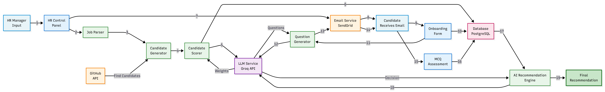

# System Architecture

## Architecture Overview



The diagram above illustrates the complete flow of the Agentic Hiring System, from HR Manager input through all processing stages to final AI-powered recommendations.

---

## Component Flow

### 1. HR Manager Input → HR Control Panel
- HR creates job posting with title and description
- System parses job requirements

### 2. Candidate Sourcing
- **Job Parser** extracts structured requirements
- **Candidate Generator** creates/finds candidate pool
- **GitHub API** (optional) for real candidate data
- **Candidate Scorer** uses AI to rank candidates with adaptive weighting

### 3. Email Automation
- **SendGrid** sends onboarding emails to top candidates
- Candidates receive personalized form links

### 4. Onboarding Process
- **Onboarding Form** collects candidate information
- Data stored in database
- **Question Generator** creates role-specific MCQ test using AI

### 5. MCQ Assessment
- **Email Service** sends assessment link
- **Groq API (LLM)** generates 10 contextual questions
- **MCQ Form** delivers timed assessment
- AI evaluates answers instantly

### 6. Final Recommendation
- **AI Recommendation Engine** analyzes all data:
  - Candidate profile match
  - Assessment scores
  - Experience alignment
- Generates hire/reject decision with justification
- Results stored in **Database (PostgreSQL)**

---

## AI Decision Points

### 🤖 Agentic AI #1: Adaptive Candidate Scoring
**Location:** `python/sourcing/candidate_scorer.py`

**Task:** Determine optimal ranking weights based on job type
- Technical roles → Higher weight on skills match
- Entry-level → Higher weight on education
- Remote roles → Lower weight on location

### 🤖 Agentic AI #2: Question Distribution
**Location:** `python/questions/question_generator.py`

**Task:** Distribute 10 questions across categories
- Senior roles → More system design questions
- Junior roles → More fundamentals
- Adapts to specific tech stack

### 🤖 Agentic AI #3: Hiring Recommendation
**Location:** `python/evaluation/recommendation_engine.py`

**Task:** Make final hiring decision
- Goes beyond simple averaging
- Considers growth potential
- Evaluates risk vs opportunity
- Provides detailed justification

---

## Technology Stack

| Layer | Technology | Cost |
|-------|-----------|------|
| **AI/LLM** | Groq API (Llama 3.1) | FREE |
| **Backend** | Python 3.9+, Flask | FREE |
| **Database** | PostgreSQL, SQLAlchemy | FREE (Open Source) |
| **Email** | SendGrid | FREE (100/day) |
| **Hosting** | Render | FREE (750hrs/month) |

**Total: $0/month** 💰

---

## Data Flow Summary

```
Job Posting → Candidate Generation → AI Scoring → Email Invitation →
Form Submission → MCQ Generation → Assessment Email → Candidate Test →
AI Evaluation → Results Email → AI Recommendation → Hire/Reject Decision
```

---

## Services Architecture

| Service | URL | Purpose |
|---------|-----|---------|
| **HR Control Panel** | `https://agentic-hiring-hr-panel.onrender.com` | Job creation & orchestration |
| **Onboarding Form** | `https://agentic-hiring-onboarding.onrender.com` | Candidate info collection |
| **MCQ Assessment** | `https://agentic-hiring-mcq.onrender.com` | Technical assessment |

All services are independently deployable microservices.

---

## Security & Scalability

### Current State (Prototype)
- JSON file storage
- No authentication
- Synchronous processing
- Single-machine deployment

### Production Path
1. Migrate to PostgreSQL with backups
2. Add JWT authentication
3. Implement Redis caching
4. Add async processing (Celery)
5. Deploy with Kubernetes
6. Multi-region with load balancing

---

*For detailed scaling suggestions, see [short_documentation.md](docs/short_documentation.md)*
