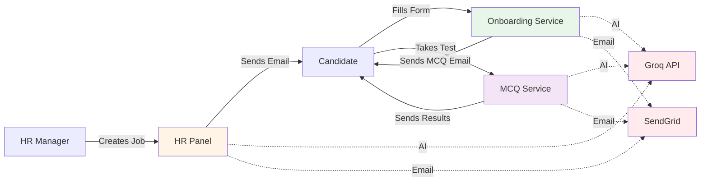
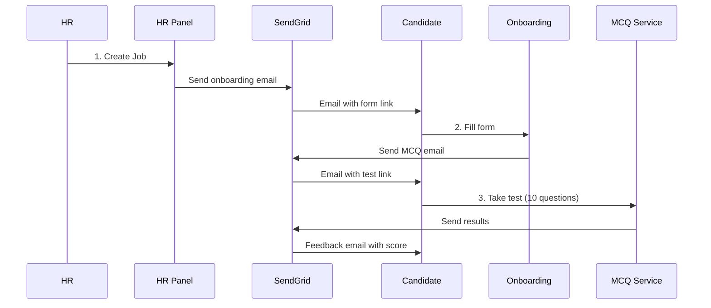

# 🤖 Agentic Hiring System

A fully automated AI-powered recruitment platform that handles the complete hiring workflow from job creation to candidate assessment.

[](https://python.org/)
[](https://flask.palletsprojects.com/)
[](https://render.com/)
[](LICENSE)

## ✨ Features

### 🤖 **AI-Powered Automation**
- **Job Description Generation** - Create professional job descriptions from a title using Groq AI
- **Smart MCQ Generation** - Generate 10 relevant technical questions based on job requirements
- **Instant Scoring** - Automatic answer evaluation with detailed feedback

### 📧 **Email Workflow**
- **Onboarding Invitations** - Automatic email to candidates with form link
- **MCQ Assessments** - Auto-send assessment after form submission
- **Instant Feedback** - Results email with score and performance breakdown

### 🔄 **Complete Automation**
Once HR creates a job, the system handles:
1. ✅ Candidate sourcing
2. ✅ Onboarding emails
3. ✅ Form processing
4. ✅ MCQ generation and delivery
5. ✅ Answer scoring
6. ✅ Feedback emails

**Zero manual intervention required!**

## 🏗️ Architecture

The system consists of 3 microservices deployed on Render:



### Services

| Service | URL | Purpose |
|---------|-----|---------|
| **HR Control Panel** | `https://agentic-hiring-hr-panel.onrender.com` | Job creation, workflow orchestration |
| **Onboarding Form** | `https://agentic-hiring-onboarding.onrender.com` | Candidate information collection |
| **MCQ Assessment** | `https://agentic-hiring-mcq.onrender.com` | Technical assessment delivery |

**[📖 Detailed Architecture →](docs/ARCHITECTURE.md)**

## 🚀 Quick Start

### Prerequisites
- Python 3.9+
- SendGrid API Key ([free tier](https://sendgrid.com/pricing/))
- Groq API Key ([free tier](https://console.groq.com/))

### Local Development

```bash
# 1. Clone repository
git clone https://github.com/OmarAI2003/Agentic-Hiring-System-Prototype.git
cd Agentic-Hiring-System-Prototype

# 2. Install dependencies
pip install -r requirements.txt

# 3. Configure environment
cp .env.example .env
# Edit .env with your API keys

# 4. Run services (3 terminals)

# Terminal 1: HR Panel
python start_hr_panel.py
# Access at: http://localhost:10000

# Terminal 2: Onboarding Form
python start_form_server.py
# Access at: http://localhost:5000

# Terminal 3: MCQ Assessment
python start_mcq_server.py
# Access at: http://localhost:5001
```

### Deployment (Render)

[](https://render.com/deploy)

1. Fork this repository
2. Connect to Render
3. Deploy using `render.yaml` (automatic)
4. Add environment variables in Render dashboard:
   - `GROQ_API_KEY`
   - `SENDGRID_API_KEY`
   - `SENDER_EMAIL`

## 📊 Complete Workflow



## 🛠️ Technology Stack

- **Backend**: Python 3.9+, Flask
- **AI/LLM**: Groq API (Llama 3.1 8B Instant)
- **Email**: SendGrid API
- **Hosting**: Render (Free Tier)
- **Storage**: JSON files (file system)
- **Frontend**: HTML, CSS, JavaScript

## 📁 Project Structure

```
Agentic-Hiring-System-Prototype/
├── python/
│   ├── sourcing/              # Candidate generation
│   ├── questions/             # MCQ generation & server
│   ├── onboarding/            # Form & email automation
│   ├── evaluation/            # Scoring engine
│   └── utils/                 # Helpers & utilities
├── templates/                 # HTML templates
├── data/                      # Job/candidate/question files
├── docs/                      # Documentation
│   └── ARCHITECTURE.md        # Detailed architecture
├── start_hr_panel.py          # HR panel launcher
├── start_form_server.py       # Onboarding launcher
├── start_mcq_server.py        # MCQ launcher
├── render.yaml                # Render deployment config
├── requirements.txt           # Python dependencies
└── README.md                  # This file
```

## 🎯 Usage

### For HR Managers

1. **Access HR Panel**: `https://agentic-hiring-hr-panel.onrender.com`
2. **Create a Job**:
   - Enter job title (e.g., "Python Developer")
   - Click "Generate with AI" for description
   - Enter number of candidates
3. **Start Workflow**: Click "Start Recruitment Workflow"
4. **Done!** System handles everything automatically

### For Candidates

1. **Receive onboarding email** with form link
2. **Fill onboarding form** with your information
3. **Receive MCQ email** with assessment link
4. **Take 10-question test** (AI-generated based on job)
5. **Receive instant feedback** with score and results

## 💰 Cost

**$0/month** using free tiers:

- **Render**: 750 hours/month free (3 services)
- **Groq API**: 14,400 requests/day free
- **SendGrid**: 100 emails/day free

## 📝 Environment Variables

```bash
# Required for all services
GROQ_API_KEY=your_groq_api_key
SENDGRID_API_KEY=your_sendgrid_api_key
SENDER_EMAIL=your_verified_email@example.com

# Service URLs (auto-configured on Render)
ONBOARDING_FORM_URL=https://agentic-hiring-onboarding.onrender.com/onboarding
MCQ_FORM_URL=https://agentic-hiring-mcq.onrender.com/mcq
```

## 🔒 Security

- ✅ HTTPS enabled (Render default)
- ✅ Environment variables for secrets
- ✅ No hardcoded credentials
- ✅ SendGrid verified sender
- 🔄 Recommended: Rotate API keys regularly

## 🤝 Contributing

Contributions welcome! Please:

1. Fork the repository
2. Create a feature branch
3. Make your changes
4. Submit a pull request

## 📄 License

MIT License - see [LICENSE](LICENSE) file for details

## 🙏 Acknowledgments

- **Groq** for fast, free LLM inference
- **SendGrid** for reliable email delivery
- **Render** for easy cloud deployment
- **Flask** for lightweight web framework

## 📞 Support

- **Issues**: [GitHub Issues](https://github.com/OmarAI2003/Agentic-Hiring-System-Prototype/issues)
- **Documentation**: [docs/ARCHITECTURE.md](docs/ARCHITECTURE.md)

---

**Built with ❤️ by [Omar AI](https://github.com/OmarAI2003)**

**Status**: ✅ Production Ready | **Version**: 1.0.0 | **Last Updated**: November 2025
